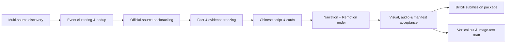

# AI Daily Briefing

> An evidence-first, auditable automation pipeline that turns AI news into Chinese-language videos for content creators.

[**简体中文**](README.md) · English


AI Daily Briefing collects the AI developments of the last 24 hours — scattered across official sites, changelogs, papers, media and communities — and turns them into Chinese videos where every claim has an on-screen evidence shot. It does not rewrite RSS summaries as news. It tiers sources, clusters events, back-tracks to official sources, freezes facts, renders narration, and runs pre-publish acceptance checks, producing one traceable submission package.


## Highlights

- **Evidence first**: every story keeps its original link, source tier, publication time, evidence screenshot and risk flag.
- **Fail closed**: stale news, future timestamps, low-information copy, missing screenshots, audio anomalies or manifest mismatches all block publishing.
- **Full content production**: Chinese script, subtitles, narration, 1080p/4K video, cover art and platform submission metadata are generated automatically.
- **Reviewable**: script, frames, audio and the submission package each have their own audit file, bound to a single run by SHA-256.
- **Model-agnostic**: discovery, gates and rendering are plain local code; a human or an AI agent can plug in as an optional review layer.
- **Credentials safe by default**: sessions, browser profiles, tokens, run logs and daily artifacts never enter Git.

## Workflow



RSS feeds, aggregator pages and community posts only supply leads. Nothing reaches the final video unless it passes the freshness, evidence, copy and visual gates one by one.

## Quick start

### Requirements

- Windows 10/11
- Python 3.11 or newer
- Node.js 22 or newer
- FFmpeg

### Install

```powershell
py -3 -m pip install -e .
npm --prefix .\remotion ci
```

### Build today's briefing

```powershell
py -3 -m briefing run --date today --target bilibili
```

Render the 4K version:

```powershell
py -3 -m briefing run --date today --target bilibili --quality 4k
```

Collect and prepare the review package only, without rendering:

```powershell
py -3 -m briefing prepare-review --date today --target bilibili
```

## Outputs

Each run is written to `runs/YYYY-MM-DD/`:

| File | Purpose |
| --- | --- |
| `final.mp4` | Final horizontal video |
| `cover.png` / `cover-16x9.png` | 4:3 and 16:9 covers |
| `subtitles.srt` | Chinese subtitles |
| `script.json` | Narration, cards and real timings |
| `fact-check.md` | Facts, risk levels and evidence chain |
| `sources.md` | Source health and collection results |
| `bilibili.md` / `bilibili.json` | Title, description, tags and category |
| `manifest.json` | Machine-readable run manifest |
| `evidence-screenshots/` | Raw evidence frames |


## Quality gates

Before publishing, at minimum:

```powershell
py -3 -m briefing verify-run --run-dir .\runs\YYYY-MM-DD
py -3 -m briefing bilibili-preflight --run-dir .\runs\YYYY-MM-DD
```

Main checks:

- Whether each story's timestamp falls inside the configured freshness window.
- Whether core facts trace back to an official source or reliable primary evidence.
- Whether rumours, community signals and confirmed facts carry distinct labels.
- Whether every required evidence screenshot actually appears in the finished video.
- Whether subtitles, timings, cover, audio and submission metadata all come from the same run.
- Whether LUFS, true peak, long silences and media parameters pass acceptance.

If any critical check fails, `publish_allowed` stays `false`.

## Sources & configuration

News sources, collection windows and experimental switches live in [sources.yaml](sources.yaml) (comments are Chinese-only for now). Keep the defaults for your first local run, then tune the source list for your own audience.

For sites that require login, use a project-dedicated browser profile:

```powershell
powershell -ExecutionPolicy Bypass -File .\scripts\open_authenticated_browser.ps1 -Url "https://x.com/"
```

Sessions are stored only in the Git-ignored `.local/`. Never copy your everyday browser profile, cookies or account exports into the repository.

Narration defaults to Edge TTS. IndexTTS2 is an optional backend that requires an explicit local install path and a licensed voice profile:

```powershell
$env:BRIEFING_INDEXTTS2_ROOT = "D:\path\to\IndexTTS2"
powershell -ExecutionPolicy Bypass -File .\scripts\run_indextts2.ps1 -Profile "your-profile-id"
```

## Optional agent review

The project can produce a full diagnostic package from local code alone, or hand it to a human or an AI agent for source review, editorial selection and final acceptance. The repository ships one constrained agent workflow:

```powershell
py -3 -m briefing prepare-agent --date today --quality 1080p --force
py -3 -m briefing finalize-agent --run-dir .\runs\YYYY-MM-DD
py -3 -m briefing render-agent --run-dir .\runs\YYYY-MM-DD --quality 1080p
py -3 -m briefing complete-agent-run --run-dir .\runs\YYYY-MM-DD
```

An agent may only edit within the frozen story and fact set; it cannot bypass sources, media hashes or the publish gate. Implementation details are in the [agent automation runbook](docs/codex-automation-runbook.md).

## Publishing to Bilibili

The publish command is dry-run by default:

```powershell
py -3 -m briefing bilibili-publish --run-dir .\runs\YYYY-MM-DD --tid 231
```

Before a real upload, store your open-platform credentials encrypted against the current Windows user:

```powershell
powershell -ExecutionPolicy Bypass -File .\scripts\configure_bilibili.ps1
py -3 -m briefing bilibili-check-auth
```

Only after preflight passes, use the explicit `--execute`:

```powershell
py -3 -m briefing bilibili-publish --run-dir .\runs\YYYY-MM-DD --execute
```

## Testing

```powershell
py -3 -m unittest discover -s tests -v
npm --prefix .\remotion test
npm --prefix .\remotion run typecheck
```

GitHub Actions runs the Python tests on 3.11 and 3.13, and checks the Remotion timeline and TypeScript types separately.

## Repository boundaries

This public repository contains only source code, tests, example configuration and reviewed showcase assets. The following must always stay on the local machine:

- `.env`, tokens, cookies, browser sessions and Windows credentials.
- `.local/`, `runs/`, `logs/`, databases and evidence caches.
- Voice models, images, video clips and third-party material without public redistribution rights.
- Account IDs, upload-console screenshots and absolute local paths.

To report a security issue, use GitHub Private Vulnerability Reporting; never paste credentials or session data into a public issue. See [SECURITY.md](SECURITY.md).

## Contributing

Source adapters, fact-checking rules, render templates, tests and docs are all welcome. Please read [CONTRIBUTING.md](CONTRIBUTING.md) first.

## License

[MIT License](LICENSE)
