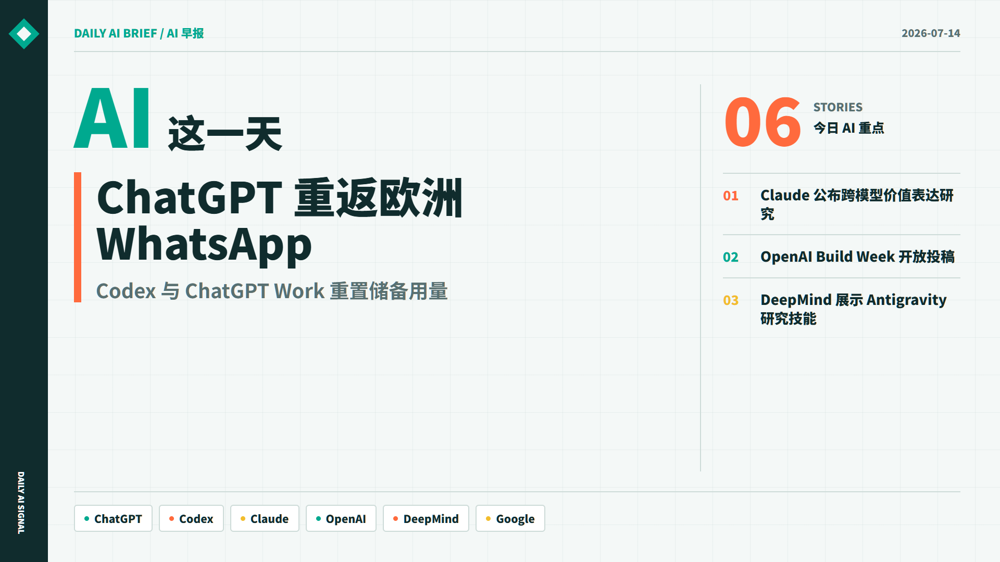
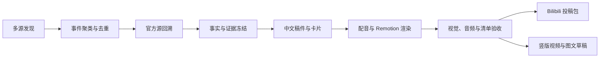
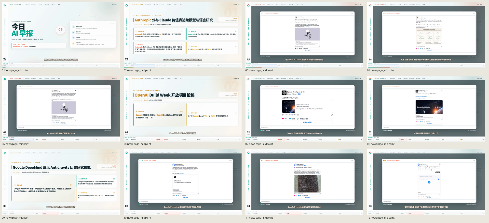

# AI Daily Briefing

> 一个证据优先、可审计、面向中文内容创作者的 AI 新闻视频自动化流水线。


AI Daily Briefing 把过去 24 小时分散在官网、更新日志、论文、媒体和社区中的 AI 动态，整理为带证据画面的中文视频。它不把 RSS 摘要直接改写成新闻，而是执行来源分级、事件聚类、官方源回溯、事实冻结、配音渲染和发布前验收，最终生成一套可追溯的投稿包。



## 项目亮点

- **证据优先**：每条新闻保留原始链接、来源等级、发布时间、证据截图和风险标记。
- **失败即阻断**：旧闻、未来时间、低信息文案、缺失截图、音频异常或清单不一致都会阻止发布。
- **完整内容生产**：自动生成中文稿件、字幕、配音、1080p/4K 视频、封面和平台投稿信息。
- **可复核**：稿件、画面、音频和发布包均有独立审计文件，并通过 SHA-256 绑定同一次运行。
- **模型解耦**：采集、门禁和渲染由本地代码完成；人工或 AI Agent 可作为可选复核层接入。
- **默认保护凭据**：登录态、浏览器配置、Token、运行日志和每日产物均不会进入 Git。

## 工作流



RSS、聚合页和社区帖子只负责发现线索。能够进入最终视频的内容，必须在新鲜度、证据、文案和视觉门禁中逐项通过。

## 快速开始

### 环境

- Windows 10/11
- Python 3.11 或更高版本
- Node.js 22 或更高版本
- FFmpeg

### 安装

```powershell
py -3 -m pip install -e .
npm --prefix .\remotion ci
```

### 生成今日快报

```powershell
py -3 -m briefing run --date today --target bilibili
```

生成 4K 版本：

```powershell
py -3 -m briefing run --date today --target bilibili --quality 4k
```

只采集和准备审稿包，不渲染视频：

```powershell
py -3 -m briefing prepare-review --date today --target bilibili
```

## 输出内容

每次运行保存在 `runs/YYYY-MM-DD/`：

| 文件 | 用途 |
| --- | --- |
| `final.mp4` | 最终横版视频 |
| `cover.png` / `cover-16x9.png` | 4:3 与 16:9 封面 |
| `subtitles.srt` | 中文字幕 |
| `script.json` | 口播、卡片和真实时间轴 |
| `fact-check.md` | 事实、风险等级与证据链 |
| `sources.md` | 来源健康和采集结果 |
| `bilibili.md` / `bilibili.json` | 标题、简介、标签和分区信息 |
| `manifest.json` | 机器可读的运行清单 |
| `evidence-screenshots/` | 原始证据画面 |



## 质量门禁

发布前至少执行：

```powershell
py -3 -m briefing verify-run --run-dir .\runs\YYYY-MM-DD
py -3 -m briefing bilibili-preflight --run-dir .\runs\YYYY-MM-DD
```

主要检查项：

- 新闻时间是否位于配置的新鲜窗口内。
- 核心事实是否能追溯到官方源或可靠的一手证据。
- 传闻、社区反馈和已确认事实是否使用不同标签。
- 必需证据截图是否真实出现在成片中。
- 字幕、时间轴、封面、音频和投稿信息是否来自同一次运行。
- LUFS、True Peak、长静音和媒体参数是否通过验收。

任何关键项失败时，`publish_allowed` 都会保持为 `false`。

## 来源与配置

新闻源、采集窗口和实验开关集中在 [sources.yaml](sources.yaml)。建议先保留默认值完成一次本地运行，再按自己的受众调整来源。

需要登录的站点应使用项目专用浏览器配置：

```powershell
powershell -ExecutionPolicy Bypass -File .\scripts\open_authenticated_browser.ps1 -Url "https://x.com/"
```

登录态只保存在被 Git 忽略的 `.local/`。不要把日常浏览器配置、Cookie 或账号导出文件复制到仓库。

默认配音使用 Edge TTS。IndexTTS2 是可选后端，必须显式提供本地安装路径和已授权音色：

```powershell
$env:BRIEFING_INDEXTTS2_ROOT = "D:\path\to\IndexTTS2"
powershell -ExecutionPolicy Bypass -File .\scripts\run_indextts2.ps1 -Profile "your-profile-id"
```

## 可选 Agent 复核

项目可以完全由本地代码生成诊断包，也可以接入人工或 AI Agent 做来源复核、稿件取舍和成片验收。当前仓库提供一套受约束的 Agent 工作流：

```powershell
py -3 -m briefing prepare-agent --date today --quality 1080p --force
py -3 -m briefing finalize-agent --run-dir .\runs\YYYY-MM-DD
py -3 -m briefing render-agent --run-dir .\runs\YYYY-MM-DD --quality 1080p
py -3 -m briefing complete-agent-run --run-dir .\runs\YYYY-MM-DD
```

Agent 只能在冻结的故事和事实范围内编辑，不能绕过来源、媒体哈希或发布门禁。实现细节见 [Codex 自动化运行手册](docs/codex-automation-runbook.md)。

## Bilibili 发布

发布命令默认仅执行 dry-run：

```powershell
py -3 -m briefing bilibili-publish --run-dir .\runs\YYYY-MM-DD --tid 231
```

真实上传前，使用脚本将开放平台凭据加密保存到当前 Windows 用户：

```powershell
powershell -ExecutionPolicy Bypass -File .\scripts\configure_bilibili.ps1
py -3 -m briefing bilibili-check-auth
```

只有在 preflight 通过后，才使用显式的 `--execute`：

```powershell
py -3 -m briefing bilibili-publish --run-dir .\runs\YYYY-MM-DD --execute
```

## 测试

```powershell
py -3 -m unittest discover -s tests -v
npm --prefix .\remotion test
npm --prefix .\remotion run typecheck
```

GitHub Actions 会在 Python 3.11 和 3.13 上运行 Python 测试，并单独检查 Remotion 时间轴与 TypeScript 类型。

## 仓库边界

公开仓库只包含源码、测试、示例配置和经过筛选的展示素材。以下内容必须始终留在本机：

- `.env`、Token、Cookie、浏览器登录态和 Windows 凭据。
- `.local/`、`runs/`、`logs/`、数据库和证据缓存。
- 未取得公开授权的音色、图片、视频和第三方材料。
- 账号 ID、投稿后台截图和本机绝对路径。

发现安全问题时，请使用 GitHub Private Vulnerability Reporting，不要在公开 Issue 中粘贴凭据或登录信息。详见 [SECURITY.md](SECURITY.md)。

## 参与贡献

欢迎提交来源适配、事实核验规则、渲染模板、测试和文档改进。开始前请阅读 [CONTRIBUTING.md](CONTRIBUTING.md)。

## License

本项目采用 [MIT License](LICENSE)。
